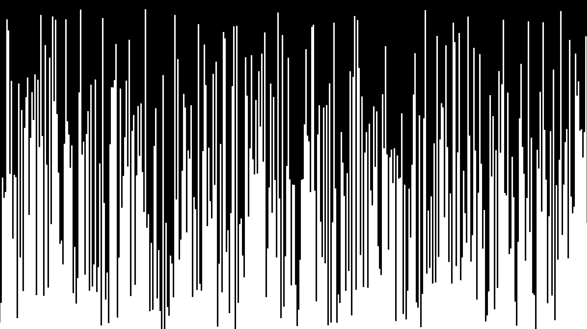
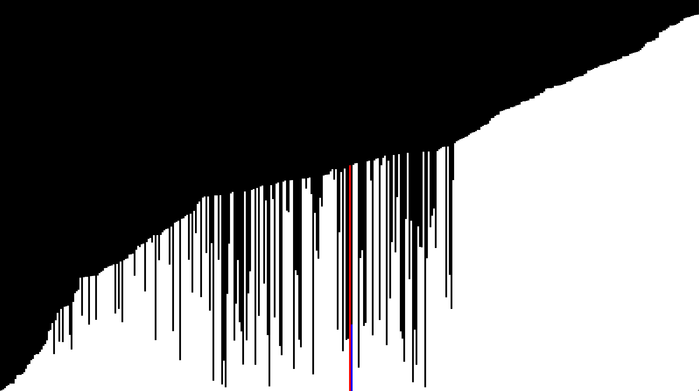
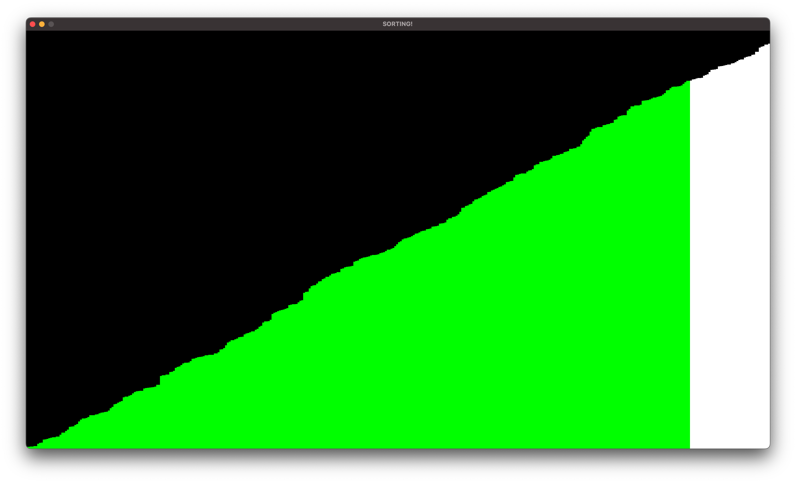

# SORTING ALGORITHMS
This project is made entirely using c++ and the SFML multi-media library.
This project includes *POTENTIALLY* 5 different sorting algorithms to choose from, including the ability to adjust the number of bars to sort, and the speed at which they are sorted.

# CONTROLS
There *WILL* be buttons to use to edit the algorithms, speed and number of bars, however, the keyboard can also be used.

Press _SPACE_ to begin the sort

Press _1 2 3 4 5_ to choose the algorithms

Press the up and down arrows to adjust the speed of the sorting

# IMAGES

